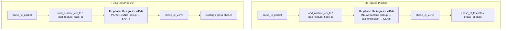

# Design Document: L4 LB Phase B Datapath Implementation

## Overview

Phase B implements the first real eBPF datapath for node-local L4 service load balancing in Aria. Building on the completed Phase A shadow planning layer and Phase B Steps 1–2 (map schema structs + `svc_ops` write/clear), this design covers:

1. **eBPF LB module** (`ebpf/src/lb.rs`) — frontend lookup, random backend selection, DNAT rewrite, and RevNat return-path rewrite in the TC packet pipeline
2. **Agent materialization** — converting compiled `ServiceProgramIr` into concrete map writes via `svc_ops`
3. **Apply-status reporting** — replacing shadow-only warnings with real materialization status

Phase B scope is strictly bounded: node-local forwarding only, random LB algorithm only (`lb_algo == 0`), no session affinity, no maglev, no cross-node handoff. The frozen map schema from RFC-008A governs all struct layouts.

### Key Design Decisions

- **Single new eBPF module**: All LB logic lives in `ebpf/src/lb.rs`, keeping the existing pipeline phases untouched except for two call-site insertions (TC ingress + TC egress).
- **Inline helpers for lookup, `#[inline(never)]` for DNAT**: Frontend lookup and backend selection are small `#[inline(always)]` helpers. DNAT rewrite uses `#[inline(never)]` to isolate its stack frame (checksum scratch, header offsets).
- **No new maps or scratch buffers**: Phase B reuses the three existing SVC maps and the existing `PipelineCtx` scratch. No new per-CPU arrays are needed — the LB helpers operate on scalars and map pointers only.
- **Agent-side service_id allocation**: Sequential u32 from 1, generation-scoped. Simple counter, no persistence needed.
- **Clear-before-write**: Each new generation calls `clear_service_maps_for_tap` before writing, ensuring no stale entries survive.

## Architecture

### Pipeline Integration

The LB module inserts into the existing TC pipeline at two points:



**Ingress placement rationale**: LB runs *before* conntrack so that DNAT-rewritten packets enter CT with the backend destination. This means CT entries are keyed on `(client → backend)`, not `(client → VIP)`, which is the standard approach for transparent DNAT-based LB.

**Egress placement rationale**: RevNat runs *before* existing egress processing so that return traffic from backends is rewritten to the VIP source before CT lookup and QoS evaluation see it.

### Call Depth Budget

From TC entry point (`tc_ingress` → `try_tc_ingress`), the current maximum call depth is ~4 levels. The LB module adds at most 2 levels:

```
tc_ingress (level 0)
  → try_tc_ingress (level 1, #[inline(never)])
    → lb::phase_lb_ingress_v4 (level 2, #[inline(never)])
      → lb::svc_frontend_lookup (level 3, #[inline(always)] — inlined into level 2)
      → lb::svc_backend_select (level 3, #[inline(always)] — inlined into level 2)
      → lb::svc_dnat_v4 (level 3, #[inline(never)] — separate stack frame)
    → phase_ct_v4 (level 2)
      → ... existing chain
```

Total worst-case depth: 5 (within the project soft limit of 5–6).

## Components and Interfaces

### 1. `ebpf/src/lb.rs` — LB Module

Public functions called from `ebpf/src/lib.rs`:

| Function | Annotation | Purpose |
|----------|-----------|---------|
| `phase_lb_ingress_v4(ctx, info, pipe)` | `#[inline(never)]` | IPv4 ingress: frontend lookup → backend select → DNAT |
| `phase_lb_ingress_v6(ctx, info, pipe)` | `#[inline(never)]` | IPv6 ingress: same flow for IPv6 packets |
| `phase_lb_egress_v4(ctx, info, pipe)` | `#[inline(never)]` | IPv4 egress: RevNat SNAT rewrite |
| `phase_lb_egress_v6(ctx, info, pipe)` | `#[inline(never)]` | IPv6 egress: RevNat SNAT rewrite for IPv6 |

Internal helpers (all `#[inline(always)]`, inlined into the phase functions):

| Helper | Purpose | Stack budget |
|--------|---------|-------------|
| `svc_frontend_lookup_v4(tap_id, info)` | Build `SvcFrontendKey` from IPv4 packet fields, lookup `SVC_FRONTEND_MAP` | ~28 bytes (key on stack) |
| `svc_frontend_lookup_v6(tap_id, info)` | Build `SvcFrontendKey` from IPv6 packet fields, lookup `SVC_FRONTEND_MAP` | ~28 bytes (key on stack) |
| `svc_backend_select(tap_id, service_id, backend_count)` | `bpf_get_prandom_u32() % backend_count`, lookup `SVC_BACKEND_MAP` | ~16 bytes (key on stack) |
| `svc_revnat_lookup_v4(tap_id, info)` | Build `SvcRevNatKey` from IPv4 source fields, lookup `SVC_REVNAT_MAP` | ~28 bytes (key on stack) |
| `svc_revnat_lookup_v6(tap_id, info)` | Build `SvcRevNatKey` from IPv6 source fields, lookup `SVC_REVNAT_MAP` | ~28 bytes (key on stack) |

DNAT/SNAT rewrite functions (`#[inline(never)]` to isolate stack):

| Function | Purpose | Stack budget |
|----------|---------|-------------|
| `svc_dnat_v4(ctx, info, backend)` | Rewrite IPv4 dst IP + dst port, incremental checksum | < 128 bytes |
| `svc_dnat_v6(ctx, info, backend)` | Rewrite IPv6 dst IP + dst port, incremental checksum | < 128 bytes |
| `svc_snat_v4(ctx, info, revnat)` | Rewrite IPv4 src IP + src port (RevNat), incremental checksum | < 128 bytes |
| `svc_snat_v6(ctx, info, revnat)` | Rewrite IPv6 src IP + src port (RevNat), incremental checksum | < 128 bytes |

### 2. `ebpf/src/lib.rs` — Pipeline Integration Points

Two modifications to existing code:

**TC Ingress** (`try_tc_ingress`): Insert LB phase call after `load_feature_flags_tc` and before `phase_ct_v4/v6`:

```rust
// After load_feature_flags_tc(p, info):
if info.proto == IPPROTO_TCP || info.proto == IPPROTO_UDP {
    if info.is_ipv6 {
        lb::phase_lb_ingress_v6(ctx, info, p);
    } else {
        lb::phase_lb_ingress_v4(ctx, info, p);
    }
}
```

**TC Egress** (`try_tc_egress`): Insert RevNat phase call after `load_feature_flags_tc` and before `phase_ct_v4/v6`:

```rust
// After load_feature_flags_tc(p, info):
if info.proto == IPPROTO_TCP || info.proto == IPPROTO_UDP {
    if info.is_ipv6 {
        lb::phase_lb_egress_v6(ctx, info, p);
    } else {
        lb::phase_lb_egress_v4(ctx, info, p);
    }
}
```

### 3. Agent Materialization (`agent/src/platform_agent.rs`)

New function: `materialize_service_maps(pin_path, tap_id, service_programs) -> Result<MaterializeResult, String>`

Flow:
1. Call `clear_service_maps_for_tap(pin_path, tap_id)` to remove stale entries
2. Allocate `service_id` counter starting from 1
3. For each `ServiceProgramIr` where `shadow_apply_only == false`:
   a. Assign `service_id` (same ID for all listener ports of the same service)
   b. Filter backends: only `admin_state != "disabled"` AND `resolved_locality == "local"`
   c. Build compact slot array (0-based, no holes)
   d. For each listener port: build `SvcFrontendEntry` with `backend_count` = number of local slots
   e. For each local backend slot: build `SvcBackendEntry`
   f. For each `(backend_ip, backend_port, protocol)`: build `SvcRevNatEntry`
4. Call `write_service_frontends`, `write_service_backends`, `write_service_revnats`
5. Return success/failure with counts

### 4. Apply-Status Reporting

Modify the existing `build_runtime_execution_summary` to:
- When `materialize_service_maps` succeeds: set services domain status to `"applied"` instead of `"shadow_execute_planned"`
- When it fails: set status to `"failed"` with `ApplyObjectFailure` details
- When no `service_programs` exist: set status to `"applied"` with zero compiled objects

### 5. IPv4 Address Encoding

Reuse the existing `ipv4_to_v4mapped` function in `core/src/svc_ops.rs` for all address conversions. The eBPF side extracts IPv4 from V4-mapped-v6 by reading bytes `[12..16]`.


## Data Models

### Existing Structs (Frozen — RFC-008A)

All map key/value structs are already defined in both `ebpf/src/common.rs` and `core/src/common.rs`. No changes needed:

| Struct | Size | Location |
|--------|------|----------|
| `SvcFrontendKey` | 24 bytes | `{tap_id, address[16], port, proto, scope}` |
| `SvcFrontendValue` | 12 bytes | `{service_id, backend_count, flags, lb_algo, pad[3]}` |
| `SvcBackendKey` | 12 bytes | `{tap_id, service_id, slot, pad[2]}` |
| `SvcBackendValue` | 24 bytes | `{address[16], port, weight, flags, pad[2]}` |
| `SvcRevNatKey` | 24 bytes | `{tap_id, address[16], port, proto, pad}` |
| `SvcRevNatValue` | 24 bytes | `{service_address[16], service_port, pad[6]}` |

### Existing Maps (Frozen — RFC-008A)

Already defined in `ebpf/src/maps.rs`:

| Map | Type | Capacity |
|-----|------|----------|
| `SVC_FRONTEND_MAP` | `HashMap<SvcFrontendKey, SvcFrontendValue>` | 4096 |
| `SVC_BACKEND_MAP` | `HashMap<SvcBackendKey, SvcBackendValue>` | 16384 |
| `SVC_REVNAT_MAP` | `HashMap<SvcRevNatKey, SvcRevNatValue>` | 4096 |
| `SVC_AFFINITY_MAP` | `LruHashMap<SvcAffinityKey, SvcAffinityValue>` | 65536 (not used in Phase B) |

### Constants (Existing)

```rust
// LB algorithm
pub const SVC_LB_ALGO_RANDOM: u8 = 0;

// Frontend flags (Phase B only checks local_only)
pub const SVC_FRONTEND_FLAG_LOCAL_ONLY: u16 = 1 << 2;

// Backend flags (Phase B only checks local)
pub const SVC_BACKEND_FLAG_LOCAL: u16 = 1 << 0;
```

### New: `FLAG_LB_HIT` Pipeline Flag

Add a new flag bit to `PipelineCtx.flags` to signal that LB performed a DNAT rewrite. This allows downstream phases (conntrack) to know the packet was rewritten:

```rust
pub const FLAG_LB_HIT: u16 = 1 << 8;
```

This is set in `phase_lb_ingress_v4/v6` after successful DNAT. Downstream conntrack can use this to create CT entries that account for the DNAT.

### Agent-Side Data Flow

```
ServiceProgramIr
  ├── frontend: ServiceFrontendIr
  │     ├── vip: String (e.g. "10.0.1.100")
  │     ├── protocol: String ("tcp" / "udp")
  │     ├── listener_ports: Vec<ServiceFrontendPortIr>
  │     └── lb_policy: String ("random")
  └── backend_set: Option<BackendSetIr>
        └── backends: Vec<BackendMemberIr>
              ├── resolved_ip_hint: Option<String>
              ├── service_port: u16
              ├── weight: u16
              ├── admin_state: String
              └── resolved_locality: String ("local" / "remote")

                    ↓ materialize_service_maps()

SvcFrontendEntry → write_service_frontends() → SVC_FRONTEND_MAP
SvcBackendEntry  → write_service_backends()  → SVC_BACKEND_MAP
SvcRevNatEntry   → write_service_revnats()   → SVC_REVNAT_MAP
```

### Service ID Allocation

```
Generation N:
  ServiceProgramIr[0] → service_id = 1
  ServiceProgramIr[1] → service_id = 2
  ...

Generation N+1 (full re-allocation):
  clear_service_maps_for_tap(tap_id)
  ServiceProgramIr[0] → service_id = 1  (may be different service)
  ...
```

Service IDs are generation-scoped. Each new compilation generation re-allocates from 1. The clear-before-write pattern ensures no stale mappings survive across generations.

### Incremental Checksum Update

For DNAT/SNAT rewrites, the LB module uses the standard RFC 1624 incremental checksum update:

```
new_csum = ~(~old_csum + ~old_field + new_field)
```

This is applied to:
- IPv4 header checksum (when IP dst/src changes)
- TCP/UDP checksum (when IP dst/src and port dst/src change)

The implementation uses `bpf_l3_csum_replace` and `bpf_l4_csum_replace` TC helpers available through the aya `TcContext`, which handle the incremental update atomically.


## Correctness Properties

*A property is a characteristic or behavior that should hold true across all valid executions of a system — essentially, a formal statement about what the system should do. Properties serve as the bridge between human-readable specifications and machine-verifiable correctness guarantees.*

### Property 1: IPv4 V4-Mapped-V6 Round-Trip

*For any* valid IPv4 address `(a, b, c, d)`, encoding it with `ipv4_to_v4mapped` SHALL produce `[0,0,0,0, 0,0,0,0, 0,0,0xff,0xff, a,b,c,d]`, and extracting bytes `[12..16]` from the result SHALL recover the original IPv4 octets.

**Validates: Requirements 1.3, 3.2, 8.1, 8.2, 8.3**

### Property 2: Random Backend Slot Is Always In Range

*For any* `backend_count > 0` (u16) and *any* random u32 value, the computed slot `random_value % backend_count` SHALL be strictly less than `backend_count` (i.e., in the range `[0, backend_count)`).

**Validates: Requirements 2.1**

### Property 3: Incremental Checksum Equivalence

*For any* original IPv4 header checksum, original IP address, and new IP address, the incremental checksum update (`~(~old_csum + ~old_field + new_field)`) SHALL produce the same result as recomputing the full checksum over the modified header. The same property holds for L4 (TCP/UDP) checksum updates when both IP address and port are changed.

**Validates: Requirements 3.4, 4.2**

### Property 4: DNAT + RevNat Round-Trip Preserves VIP Identity

*For any* `(vip_address, vip_port, backend_address, backend_port, protocol)` tuple where both DNAT and RevNat map entries exist, if a packet with `dst = (vip_address, vip_port)` is DNAT-rewritten to `dst = (backend_address, backend_port)` on ingress, then the corresponding return packet with `src = (backend_address, backend_port)` SHALL be RevNat-rewritten to `src = (vip_address, vip_port)` on egress, recovering the original VIP identity.

**Validates: Requirements 3.1, 4.1**

### Property 5: Service ID Allocation Is Sequential and Consistent

*For any* list of `ServiceProgramIr` objects, the materializer SHALL assign `service_id` values as sequential u32 integers starting from 1, and all frontend entries belonging to the same service (across multiple listener ports) SHALL share the same `service_id`.

**Validates: Requirements 6.2, 7.1, 7.2**

### Property 6: Frontend backend_count Matches Written Backend Slots

*For any* service with a backend set, the `backend_count` field in every `SvcFrontendEntry` for that service SHALL equal the number of `SvcBackendEntry` records actually written for that service's `service_id` (i.e., the count of local, non-disabled backends).

**Validates: Requirements 6.3, 6.4**

### Property 7: Backend Slot Compaction Invariant

*For any* backend set containing a mix of local/remote and enabled/disabled backends, the materializer SHALL write only backends where `admin_state != "disabled"` AND `resolved_locality == "local"`, and the resulting slot indices SHALL be a compact 0-based sequence `[0, 1, 2, ..., n-1]` with no gaps.

**Validates: Requirements 6.3, 10.5**

### Property 8: RevNat Entry Completeness

*For any* set of materialized backend entries, there SHALL exist exactly one `SvcRevNatEntry` for each unique `(backend_ip, backend_port, protocol)` combination, mapping back to the corresponding service VIP and service port.

**Validates: Requirements 6.5**

## Error Handling

### eBPF Datapath (Fail-Open)

All error paths in the LB module follow a **fail-open** strategy — if any lookup or rewrite fails, the packet continues through the pipeline unmodified:

| Error Condition | Behavior |
|----------------|----------|
| `SVC_FRONTEND_MAP` lookup miss | Packet passes through (no LB) |
| `backend_count == 0` | Packet passes through (no backends) |
| `SVC_BACKEND_MAP` lookup miss | Packet passes through (stale slot) |
| Backend not `FLAG_LOCAL` | Packet passes through (Phase C deferred) |
| `lb_algo != SVC_LB_ALGO_RANDOM` | Packet passes through (Phase C deferred) |
| DNAT rewrite failure (bounds check) | Packet passes through unmodified |
| `SVC_REVNAT_MAP` lookup miss | Packet passes through (no RevNat needed) |
| RevNat rewrite failure | Packet passes through unmodified |

This ensures the LB module never drops traffic — worst case, VIP traffic is forwarded without translation (which will fail at the application layer but won't cause silent packet loss).

### Agent Materialization (Fail-Report)

| Error Condition | Behavior |
|----------------|----------|
| `open_frontend_map` fails | Log error, report `"failed"` status with details |
| `write_service_frontends` fails | Log error, report `"failed"` status, continue with other services |
| `write_service_backends` fails | Log error, report `"failed"` status |
| `write_service_revnats` fails | Log error, report `"failed"` status |
| `clear_service_maps_for_tap` fails | Log warning, attempt writes anyway (best-effort cleanup) |
| Invalid IP address in `resolved_ip_hint` | Skip backend, log warning, decrement `backend_count` |
| No `service_programs` in compiled state | Report `"applied"` with zero objects (empty success) |

The agent loop never crashes on materialization errors. All failures are captured in the `ApplyStatusReport` and reported to the controller.

## Testing Strategy

### Unit Tests (Example-Based)

Focus on specific scenarios and edge cases:

- Frontend lookup miss (non-VIP destination) → packet unmodified
- Backend count zero → skip selection
- Backend map miss → skip DNAT
- Remote backend (no `FLAG_LOCAL`) → skip DNAT
- Non-random `lb_algo` → skip selection
- RevNat miss → packet unmodified
- Empty `service_programs` → `"applied"` status with zero objects
- Write failure → `"failed"` status with error details
- Generation rollover → service IDs restart from 1
- Pipeline ordering: DNAT before CT, RevNat before egress CT

### Property-Based Tests

Use the `proptest` crate (Rust PBT library) with minimum 100 iterations per property.

Each property test references its design document property:

- **Feature: service-lb-phase-b, Property 1: IPv4 V4-Mapped-V6 Round-Trip** — generate random `Ipv4Addr`, verify `ipv4_to_v4mapped` encoding and byte extraction round-trip
- **Feature: service-lb-phase-b, Property 2: Random Backend Slot Is Always In Range** — generate random `(backend_count: 1..65535, random_value: u32)`, verify `random_value % backend_count < backend_count`
- **Feature: service-lb-phase-b, Property 3: Incremental Checksum Equivalence** — generate random `(old_csum: u16, old_addr: u32, new_addr: u32)`, verify incremental update matches full recomputation
- **Feature: service-lb-phase-b, Property 4: DNAT + RevNat Round-Trip Preserves VIP Identity** — generate random `(vip, backend)` address/port pairs, simulate DNAT then RevNat, verify VIP recovery
- **Feature: service-lb-phase-b, Property 5: Service ID Allocation Is Sequential and Consistent** — generate random lists of `ServiceProgramIr` with varying listener port counts, verify sequential IDs and per-service consistency
- **Feature: service-lb-phase-b, Property 6: Frontend backend_count Matches Written Backend Slots** — generate random services with mixed backend states, verify count consistency
- **Feature: service-lb-phase-b, Property 7: Backend Slot Compaction Invariant** — generate random backend sets with mixed locality/admin_state, verify compact 0-based slots with correct filtering
- **Feature: service-lb-phase-b, Property 8: RevNat Entry Completeness** — generate random backend sets, verify one RevNat entry per unique `(ip, port, proto)` tuple

### Integration Tests

End-to-end verification (requires eBPF runtime or test harness):

- Node-local TCP LB: client → VIP:port → backend:port, verify DNAT + RevNat
- Node-local UDP LB: same flow for UDP
- Multiple backends: verify traffic distributes across backends
- Service with no backends: verify pass-through
- Generation rollover: verify stale entries are cleaned up
- Apply-status reporting: verify `"applied"` / `"failed"` status reaches controller

### Scope Guard Tests

Verify Phase B boundaries are not violated:

- No `SVC_AFFINITY_MAP` reads/writes in `lb.rs`
- No `SVC_MAGLEV_MAP` reads/writes in `lb.rs`
- No tunnel encapsulation or cross-node forwarding logic
- `lb_algo != 0` → pass-through (no crash, no selection)
