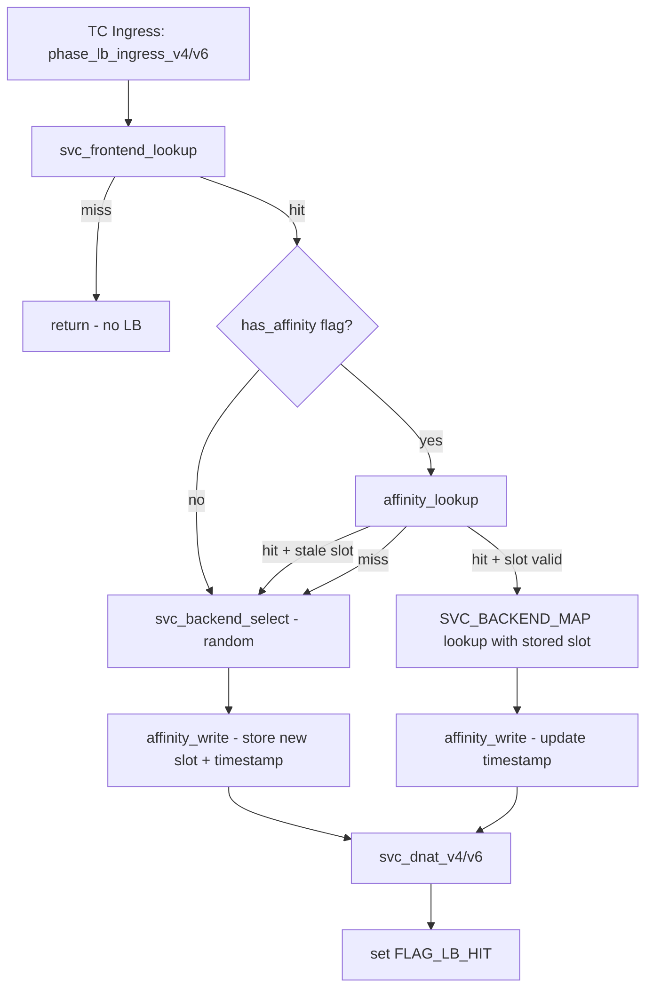

# Design Document: L4 LB Session Affinity (client_ip)

## Overview

This design adds client_ip session affinity to the existing L4 load balancer datapath. When a service frontend has the `SVC_FRONTEND_FLAG_HAS_AFFINITY` flag set, the eBPF ingress path checks `SVC_AFFINITY_MAP` for a previously selected backend before falling back to random selection. After every backend selection (whether from affinity hit or random), the affinity entry is written/updated with the chosen slot and current timestamp.

The change is intentionally small (~30 lines in `ebpf/src/lb.rs`, ~5 lines in `agent/src/platform_agent.rs`) because all supporting infrastructure already exists:

- `SVC_AFFINITY_MAP` (LruHashMap, 65536 entries) — defined in `ebpf/src/maps.rs`
- `SvcAffinityKey` (24 bytes) / `SvcAffinityValue` (16 bytes) — defined in both `ebpf/src/common.rs` and `core/src/common.rs`
- `SVC_FRONTEND_FLAG_HAS_AFFINITY` (bit 0) — defined in both common modules
- `bpf_ktime_get_ns` — available via `aya_ebpf::helpers`

The agent-side change is a single conditional: when `ServiceFrontendIr.frontend.session_affinity == "client_ip"`, OR the `SVC_FRONTEND_FLAG_HAS_AFFINITY` bit into the frontend entry's `flags` field.

## Architecture

The session affinity feature inserts two inline helpers into the existing LB ingress pipeline, between frontend lookup and DNAT rewrite:



The egress RevNat path (`phase_lb_egress_v4/v6`) is unchanged — it only rewrites source addresses and has no interaction with affinity.

### Agent-Side Architecture

```mermaid
flowchart LR
    A[ServiceProgramIr] --> B{session_affinity == client_ip?}
    B -->|yes| C[flags |= SVC_FRONTEND_FLAG_HAS_AFFINITY]
    B -->|no| D[flags unchanged]
    C --> E[write_service_frontends]
    D --> E
```

The agent never writes to `SVC_AFFINITY_MAP`. The map is populated exclusively by the eBPF datapath at runtime and evicted by LRU semantics.

## Components and Interfaces

### New eBPF Helpers (ebpf/src/lb.rs)

Two new `#[inline(always)]` helpers are added:

#### `affinity_lookup`

```rust
#[inline(always)]
unsafe fn affinity_lookup(
    tap_id: u32,
    service_id: u32,
    client_address: [u8; 16],
) -> Option<u16>
```

- Constructs `SvcAffinityKey { tap_id, service_id, client_address }` on the stack (24 bytes)
- Queries `SVC_AFFINITY_MAP`
- Returns `Some(backend_slot)` on hit, `None` on miss

#### `affinity_write`

```rust
#[inline(always)]
unsafe fn affinity_write(
    tap_id: u32,
    service_id: u32,
    client_address: [u8; 16],
    backend_slot: u16,
)
```

- Constructs `SvcAffinityKey` (24 bytes) and `SvcAffinityValue` (16 bytes) on the stack
- Calls `bpf_ktime_get_ns()` for the `last_used_ns` field
- Inserts/updates the entry in `SVC_AFFINITY_MAP` via `map.insert()`

#### Modified: `phase_lb_ingress_v4` / `phase_lb_ingress_v6`

The existing phase functions gain ~15 lines each. After frontend lookup succeeds:

1. Check `frontend.flags & SVC_FRONTEND_FLAG_HAS_AFFINITY`
2. If set, call `affinity_lookup` with the packet's source IP (v4-mapped for IPv4, raw for IPv6)
3. If affinity hit and `slot < frontend.backend_count`, use that slot for `SVC_BACKEND_MAP` lookup
4. If affinity miss or stale slot (`slot >= backend_count`), fall through to existing `svc_backend_select`
5. After backend is resolved, call `affinity_write` with the selected slot

### Modified Agent Function (agent/src/platform_agent.rs)

#### `materialize_service_maps`

In the frontend entry construction loop, change:

```rust
// Before:
flags: SVC_FRONTEND_FLAG_LOCAL_ONLY,

// After:
flags: SVC_FRONTEND_FLAG_LOCAL_ONLY
    | if program.frontend.session_affinity.as_deref() == Some("client_ip") {
        SVC_FRONTEND_FLAG_HAS_AFFINITY
    } else {
        0
    },
```

### Unchanged Components

- `SVC_AFFINITY_MAP` definition in `ebpf/src/maps.rs` — already exists
- `SvcAffinityKey` / `SvcAffinityValue` in `ebpf/src/common.rs` and `core/src/common.rs` — already exist
- `SVC_FRONTEND_FLAG_HAS_AFFINITY` constant — already defined
- `svc_backend_select` — unchanged, still used as fallback
- `svc_dnat_v4/v6`, `svc_snat_v4/v6` — unchanged
- `phase_lb_egress_v4/v6` — unchanged

## Data Models

All data structures already exist. No new structs or maps are introduced.

### Existing Structures Used

| Structure | Size | Location | Role |
|-----------|------|----------|------|
| `SvcAffinityKey` | 24 bytes | `ebpf/src/common.rs`, `core/src/common.rs` | Map key: `(tap_id, service_id, client_address)` |
| `SvcAffinityValue` | 16 bytes (aligned) | `ebpf/src/common.rs`, `core/src/common.rs` | Map value: `(backend_slot, last_used_ns)` |
| `SVC_AFFINITY_MAP` | LruHashMap, 65536 entries | `ebpf/src/maps.rs` | Runtime affinity state, auto-evicts LRU |
| `SvcFrontendValue.flags` | bit 0 | `ebpf/src/common.rs` | `SVC_FRONTEND_FLAG_HAS_AFFINITY` toggle |

### Stack Budget Analysis

The affinity path adds at most:
- `SvcAffinityKey`: 24 bytes
- `SvcAffinityValue`: 16 bytes (only for write path)
- Total additional: **40 bytes** (well under the 64-byte per-helper soft limit)

Both helpers are `#[inline(always)]`, so they share the caller's stack frame (`phase_lb_ingress_v4/v6`). The existing phase function stack is small (a few pointers + match temporaries), so the combined total stays well under the 256-byte soft target.

### Call Depth Analysis

Current call chain from program entry:
```
tc_ingress (entry) → phase_lb_ingress_v4 [inline(never)] → svc_frontend_lookup [inline(always)]
                                                          → svc_backend_select [inline(always)]
                                                          → svc_dnat_v4 [inline(never)]
```

With affinity, the inlined helpers (`affinity_lookup`, `affinity_write`) do not add call depth since they are `#[inline(always)]`. The `phase_lb_ingress_v4` function remains at the same call depth level. No new `#[inline(never)]` functions are introduced.


## Correctness Properties

*A property is a characteristic or behavior that should hold true across all valid executions of a system — essentially, a formal statement about what the system should do. Properties serve as the bridge between human-readable specifications and machine-verifiable correctness guarantees.*

### Property 1: Affinity key construction produces correct v4-mapped/v6 client address

*For any* `(tap_id, service_id, src_ip)` tuple where `src_ip` is either an IPv4 or IPv6 address, constructing an `SvcAffinityKey` SHALL produce `client_address` equal to `ipv4_to_v4mapped_raw(src_ip)` for IPv4 inputs and equal to the raw 16-byte `src_ip_v6` for IPv6 inputs, with `tap_id` and `service_id` fields matching the inputs exactly.

**Validates: Requirements 1.1, 4.1, 4.2**

### Property 2: Affinity slot validity decision is correct

*For any* `(backend_slot, backend_count)` pair where both are non-negative integers and `backend_count > 0`, the LB datapath SHALL use the stored affinity slot if and only if `backend_slot < backend_count`; otherwise it SHALL fall through to random backend selection.

**Validates: Requirements 1.3, 1.4, 6.1**

### Property 3: Affinity write records correct slot after selection

*For any* affinity-enabled frontend and any backend selection (whether from affinity miss, stale slot, or new random selection), the `SVC_AFFINITY_MAP` entry written by `affinity_write` SHALL contain the `backend_slot` that was actually used for the `SVC_BACKEND_MAP` lookup, with `last_used_ns` set to a value from `bpf_ktime_get_ns()`.

**Validates: Requirements 2.1, 6.2**

### Property 4: Agent sets affinity flag if and only if session_affinity is client_ip

*For any* `ServiceProgramIr`, the `SVC_FRONTEND_FLAG_HAS_AFFINITY` bit in the resulting `SvcFrontendEntry.flags` SHALL be set if and only if `frontend.session_affinity == Some("client_ip")`; for all other values (including `None` and `"none"`), the bit SHALL be clear.

**Validates: Requirements 3.1, 3.2, 6.3**

### Property 5: Affinity key construction is deterministic (same inputs → same key bytes)

*For any* two packets with identical `(tap_id, service_id, client_ip)`, the `SvcAffinityKey` constructed from each packet SHALL be byte-identical, ensuring that the same client always hits the same affinity map entry.

**Validates: Requirements 4.3**

## Error Handling

### eBPF Datapath Errors

| Scenario | Handling |
|----------|----------|
| `SVC_AFFINITY_MAP.get()` returns `None` | Fall through to random selection — this is the normal miss path |
| `SVC_AFFINITY_MAP.insert()` fails (map full, kernel error) | Silently ignored — the packet still gets DNAT'd to the selected backend; affinity just won't be recorded for this flow. LRU eviction should prevent this in practice. |
| `SVC_BACKEND_MAP.get()` fails for affinity-provided slot | Fall through to random selection (same as stale slot handling) |
| `bpf_ktime_get_ns()` returns 0 or unexpected value | No special handling — the timestamp is informational for LRU ordering; a zero value just means the entry may be evicted sooner |

### Agent-Side Errors

| Scenario | Handling |
|----------|----------|
| `session_affinity` field has unknown value (not `"client_ip"`, `"none"`, or absent) | Treat as no affinity — do not set the flag. Existing `normalize_socket_affinity_strategy` already handles this as `"unsupported"`. |
| Service switches from `client_ip` to `none` | Agent clears the flag on next materialize. Existing affinity map entries are left to expire via LRU — no explicit cleanup needed. |

### Design Rationale for Silent Failure

The eBPF datapath cannot log errors or return error codes to callers. All error paths degrade gracefully to the existing random-selection behavior. This means:
- Affinity is best-effort, not guaranteed
- A failed affinity write means the next packet from the same client gets random selection again
- This is the standard pattern for eBPF LRU map usage (same as conntrack, TCP-RT, etc.)

## Testing Strategy

### Property-Based Tests (Rust, using `proptest`)

Each correctness property maps to a property-based test with minimum 100 iterations:

1. **Property 1 test**: Generate random `(tap_id: u32, service_id: u32, src_ip: Ipv4Addr | Ipv6Addr)` → construct `SvcAffinityKey` → assert `client_address` matches expected encoding.
   - Tag: `Feature: service-lb-session-affinity, Property 1: Affinity key construction produces correct v4-mapped/v6 client address`

2. **Property 2 test**: Generate random `(backend_slot: u16, backend_count: u16)` where `backend_count > 0` → call slot validity check → assert result equals `backend_slot < backend_count`.
   - Tag: `Feature: service-lb-session-affinity, Property 2: Affinity slot validity decision is correct`

3. **Property 3 test**: Generate random `(tap_id, service_id, client_ip, selected_slot)` → call `affinity_write` → read back from map → assert `backend_slot` matches `selected_slot`.
   - Tag: `Feature: service-lb-session-affinity, Property 3: Affinity write records correct slot after selection`
   - Note: This requires a mock or in-memory map implementation since real eBPF maps aren't available in unit tests.

4. **Property 4 test**: Generate random `ServiceProgramIr` with `session_affinity` ∈ `{Some("client_ip"), Some("none"), None}` → compute flags → assert `(flags & SVC_FRONTEND_FLAG_HAS_AFFINITY) != 0` iff `session_affinity == Some("client_ip")`.
   - Tag: `Feature: service-lb-session-affinity, Property 4: Agent sets affinity flag if and only if session_affinity is client_ip`

5. **Property 5 test**: Generate random `(tap_id, service_id, client_ip)` → construct key twice → assert byte equality.
   - Tag: `Feature: service-lb-session-affinity, Property 5: Affinity key construction is deterministic`

### Unit Tests (Example-Based)

- Affinity miss → random selection used (Requirement 1.5)
- Agent does not write to `SVC_AFFINITY_MAP` (Requirement 3.3)
- Timestamp refresh on affinity hit (Requirement 2.2)

### Integration Tests

- End-to-end: configure a service with `session_affinity: client_ip`, send multiple packets from the same client IP, verify they all reach the same backend.
- Backend removal: remove a backend, verify stale affinity entries are detected and new random selection occurs.

### eBPF Verifier Smoke Tests

- Compile the eBPF program with the affinity changes and verify it passes the kernel verifier (existing CI pipeline).
- Verify stack usage stays under 256 bytes for `phase_lb_ingress_v4/v6`.
